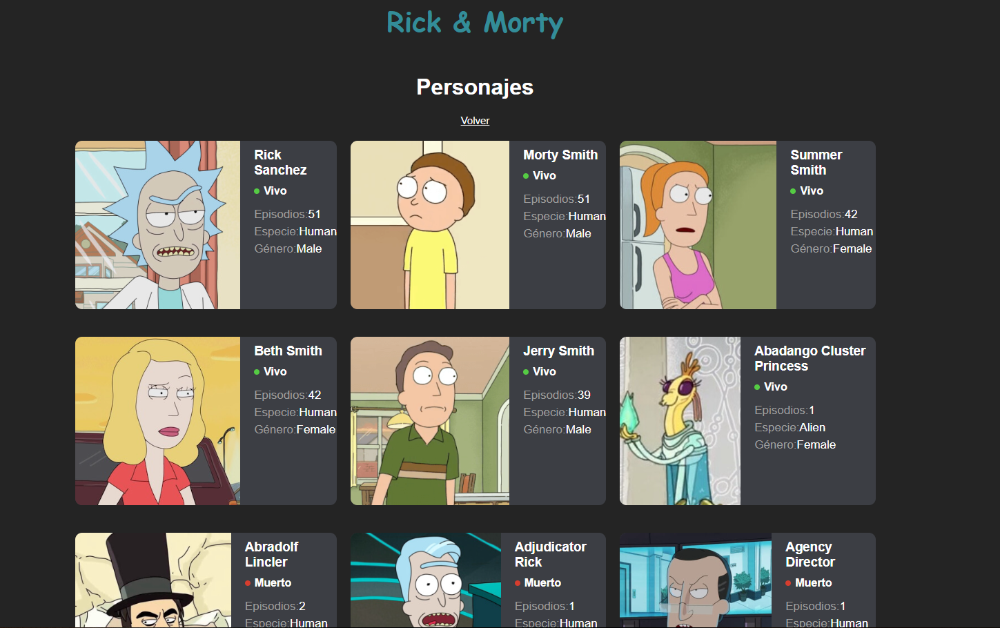

# Rick & Morty Characters App

Aplicación web desarrollada con **React** que consume la API pública de **Rick and Morty** para mostrar una lista de personajes con información relevante como estado, especie, género y número de episodios.

---

## 🚀 Características

- Consumo de la API pública de Rick and Morty
- Listado dinámico de personajes
- Información detallada por personaje:
  - Nombre
  - Estado (Vivo / Muerto)
  - Especie
  - Género
  - Número de episodios
- Manejo de estado con React Hooks
- Interfaz responsive y moderna
- Botón para volver a la pantalla principal

---

## 🛠️ Tecnologías utilizadas

- **React**
- **JavaScript (ES6+)**
- **Vite**
- **CSS**
- **Fetch API**
- **Rick and Morty API**  
  https://rickandmortyapi.com/documentation

---

## 📦 Instalación y ejecución

Sigue estos pasos para ejecutar el proyecto en tu entorno local:

1. Clona el repositorio:

        git clone https://github.com/tu-usuario/tu-repositorio.git

2. Entra al directorio del proyecto:

        cd tu-repositorio

3. Instala las dependencias:

        npm install

4. Ejecuta el servidor de desarrollo:

        npm run dev

5. Abre el navegador en:

        http://localhost:5173

## 📁 Estructura del proyecto

    src/
    ├─ components/
    │  └─ Character.jsx
    ├─ img/
    │  └─ img.png
    ├─ App.jsx
    ├─ main.jsx
    ├─ App.css

## 🧠 Funcionamiento general

* Al iniciar la aplicación, se muestra la pantalla principal.

* Al hacer clic en Lista de Personajes, se realiza una petición a la API pública de Rick and Morty.

* Los personajes se renderizan dinámicamente en tarjetas con su información principal.

* El botón Volver limpia el estado y regresa a la pantalla inicial.

## 📌 Mejoras futuras

- Implementar paginación de personajes.

- Agregar filtros por estado, especie o género.

- Añadir un buscador por nombre.

- Manejar estados de carga y error.

- Usar el id del personaje como key en lugar del índice.

